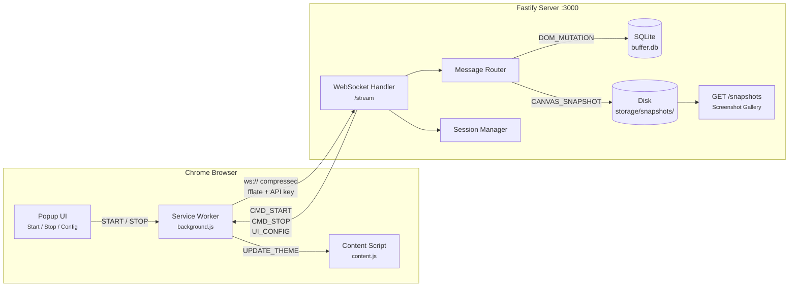
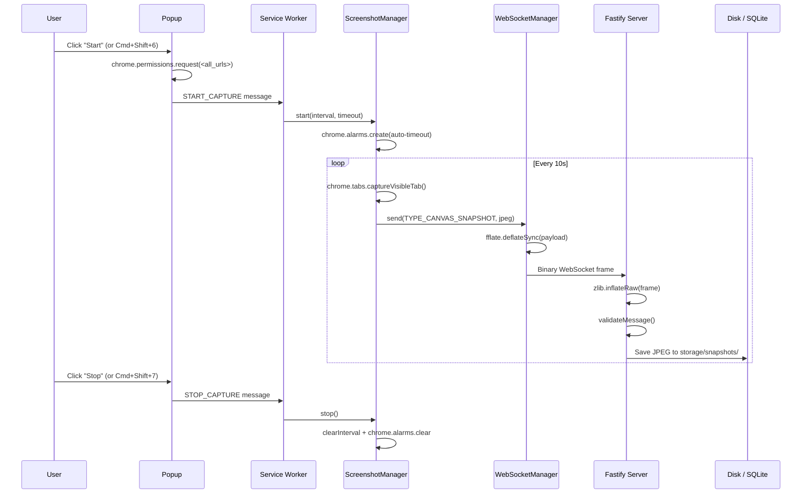
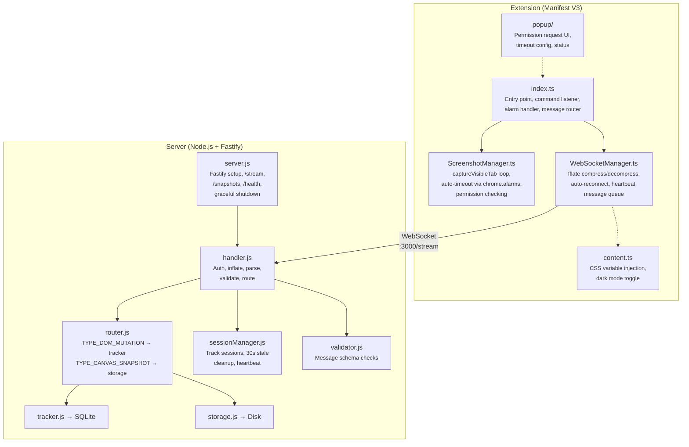

# Project Pratibimba Service

A high-performance DOM and Canvas scraper packaged as a Chrome Extension ("Theme Engine"), paired with a Fastify WebSocket server for real-time data ingestion.

## Architecture

### High-Level Overview



### Data Flow



### Component Detail



### `/extension` — Chrome Extension (Client)

| Module | Role |
|---|---|
| **WebSocketManager** | Compressed (`fflate` deflate), auto-reconnecting WebSocket with heartbeat pings |
| **ScreenshotManager** | Captures the active tab via `chrome.tabs.captureVisibleTab`, sends JPEG frames to the server |
| **Content Script** | Applies theme CSS variables received from the server (UI cover story) |
| **Popup** | Status display, start/stop control, timeout configuration, shortcut hints |

### `/server` — Node.js Fastify Backend

| Module | Role |
|---|---|
| **WebSocket handler** | Authenticates via `?api_key=...&session_id=...`, decompresses raw deflate frames |
| **Message router** | Routes `TYPE_DOM_MUTATION` to SQLite, `TYPE_CANVAS_SNAPSHOT` to disk |
| **Session manager** | Tracks active sessions, disconnects stale ones after 30s of silence |
| **DB worker** | Periodic flush of the SQLite buffer |
| **Storage** | Saves screenshots to `storage/snapshots/` with dynamic file extensions |
| **`/snapshots` endpoint** | Web gallery to browse captured screenshots at `http://localhost:3000/snapshots` |

---

## Prerequisites

- **Node.js** >= 18
- **Google Chrome** (latest stable)
- **Docker** (optional, for containerized server)

---

## Quickstart

### 1. Start the Server

```bash
cd server
npm install
npm run dev
```

The server starts at **http://127.0.0.1:3000**. You should see:

```
Server listening on http://127.0.0.1:3000
```

### 2. Build the Extension

```bash
cd extension
npm install
npm run build
```

This creates the `extension/dist/` directory with the bundled extension.

### 3. Install the Extension in Chrome

1. Open **chrome://extensions/**
2. Enable **Developer mode** (top-right toggle)
3. Click **Load unpacked** and select the `extension/dist/` folder
4. Pin the "Theme Engine" extension to the toolbar

### 4. Grant Permissions & Start Capturing

1. Click the **Theme Engine** extension icon to open the popup
2. If you see a yellow permission warning, click **Start** — Chrome will prompt you to grant site access
3. **Accept** the permission — this allows the extension to capture screenshots on all tabs
4. Screenshots are captured every 10 seconds and sent to the server

### 5. View Screenshots

Open **http://localhost:3000/snapshots** in your browser to see a live gallery of captured screenshots.

### 6. View Screenshots from Another PC (Same Wi-Fi)

Because the Fastify server listens on `0.0.0.0`, you can view the live screenshot gallery from any device on the same local network without writing any extra code!

1. Find the IP Address of the PC running the server (e.g., run `ipconfig` in PowerShell and look for the IPv4 Address, like `192.168.0.108`).
2. **If you are on Windows, you must allow Port 3000 through the Firewall**:
   - Open PowerShell **as Administrator**.
   - Run: `New-NetFirewallRule -DisplayName "Allow Node Port 3000" -Direction Inbound -LocalPort 3000 -Protocol TCP -Action Allow`
3. On the other PC (or even your phone) on the same Wi-Fi, open a browser and navigate to:
   `http://<SERVER_IP_ADDRESS>:3000/snapshots` (e.g., `http://192.168.0.108:3000/snapshots`)

---

## Keyboard Shortcuts

| Action | Mac | Windows/Linux |
|---|---|---|
| Start capture | `Cmd+Shift+6` | `Ctrl+Shift+6` |
| Stop capture | `Cmd+Shift+7` | `Ctrl+Shift+7` |

> **Note:** Keyboard shortcuts require that site permissions have already been granted via the popup at least once.

You can view or change shortcuts at **chrome://extensions/shortcuts**.

---

## Auto-Timeout

The extension automatically stops capturing after a configurable duration to prevent runaway sessions. Configure this in the popup dropdown:

| Option | Duration |
|---|---|
| 30 minutes | Short session |
| 1 hour | Medium session |
| 2 hours | Extended session |
| **3 hours** (default) | Long session |
| 6 hours | Maximum |

---

## Configuration

### Server Environment Variables

Copy the example and customize:

```bash
cp server/.env.example server/.env
```

| Variable | Default | Description |
|---|---|---|
| `PORT` | `3000` | Server port |
| `HOST` | `127.0.0.1` | Bind address |
| `X_API_KEY` | `my-super-secret-key` | WebSocket authentication key (must match extension) |
| `DB_PATH` | `buffer.db` | SQLite database file path |
| `STORAGE_DIR` | `storage` | Directory for file-based storage |
| `FLUSH_INTERVAL_MS` | `10000` | DB buffer flush interval (ms) |
| `SCREENSHOT_INTERVAL_MS` | `10000` | Screenshot capture interval (ms) |
| `LOG_LEVEL` | `info` | Pino log level: `trace`, `debug`, `info`, `warn`, `error`, `fatal` |

### Extension Configuration

The API key is set in `extension/src/background/index.ts` and must match the server's `X_API_KEY`.

---

## Docker

Run the server in a container:

```bash
docker compose up --build -d
```

This builds the server image, maps port 3000, and persists `storage/` to a Docker volume.

To stop:

```bash
docker compose down
```

---

## Testing

Run server-side unit tests:

```bash
cd server
npm test
```

Tests cover the message validator, router, session manager, storage, and tracker modules.

---

## Project Structure

```
project-pratibimba-service/
├── .github/workflows/ci.yml    # CI pipeline (tests + extension build)
├── docker-compose.yml           # Docker orchestration
├── extension/
│   ├── build.js                 # esbuild bundler script
│   ├── manifest.json            # Chrome MV3 manifest
│   ├── tsconfig.json            # TypeScript config
│   ├── package.json
│   ├── icons/                   # Extension icons (16, 48, 128 px)
│   └── src/
│       ├── background/
│       │   ├── index.ts         # Service worker entry point
│       │   ├── ScreenshotManager.ts
│       │   └── WebSocketManager.ts
│       ├── content.ts           # Content script (theme application)
│       └── popup/
│           ├── index.html       # Popup UI
│           └── popup.js         # Popup logic
├── server/
│   ├── .env.example             # Environment variable template
│   ├── Dockerfile
│   ├── jest.config.js
│   ├── package.json
│   └── src/
│       ├── config.js            # Centralized configuration
│       ├── server.js            # Fastify server entry point
│       ├── db/
│       │   ├── index.js         # SQLite setup & atomic buffer ops
│       │   ├── tracker.js       # DOM mutation tracker
│       │   └── worker.js        # Periodic buffer flush worker
│       ├── utils/
│       │   ├── logger.js        # Pino logger instance
│       │   └── storage.js       # File-based snapshot storage
│       ├── websocket/
│       │   ├── handler.js       # WebSocket connection handler
│       │   ├── router.js        # Message type router
│       │   ├── sessionManager.js # Session lifecycle management
│       │   └── validator.js     # Message validation
│       └── __tests__/           # Jest unit tests
└── README.md
```

---

## Troubleshooting

| Problem | Solution |
|---|---|
| Extension shows "Capture idle" but no screenshots appear | Open the popup and click **Start** to grant site access permissions |
| `captureVisibleTab` permission error | Remove and re-add the extension from `chrome://extensions/`, then grant permissions via the popup |
| Keyboard shortcuts don't work | Grant permissions via the popup first, then verify shortcuts at `chrome://extensions/shortcuts` |
| Server connection refused | Ensure the server is running (`npm run dev` in `server/`) and listening on port 3000 |
| Screenshots not saving to disk | Check that the server's `storage/snapshots/` directory is writable |
| `Worker is not defined` error in extension | Rebuild the extension (`npm run build` in `extension/`), then remove and re-add it in Chrome |
